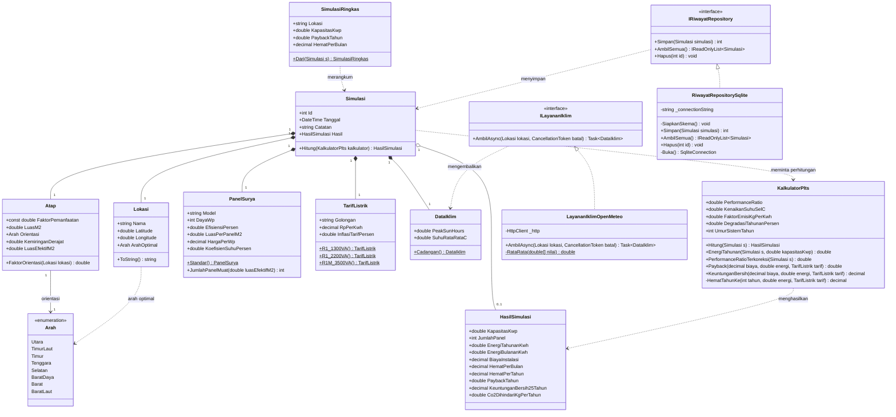

# SunCost
Aplikasi desktop untuk menghitung potensi energi, penghematan biaya,
dan waktu balik modal pemasangan panel surya atap berdasarkan data
radiasi matahari lokasi pengguna.

Kelompok SunCost
1. Ketua Kelompok: MUHAMMAD FARREL AL GHAZY - 24/540589/TK/60022
2. Anggota 1: MAYRAVIVANIA SYAHDA CHARISA - 24/538308/TK/59701
3. Anggota 2: MUHAMMAD FARREL AL GHAZY - 24/540589/TK/60022
4. Anggota 3: SRI WAHYUNI ARISTA - 23/521971/TK/57593
 


## Detail Aplikasi

- **Kategori:** Climate Action — energi terbarukan / kalkulator kelayakan investasi
- **Tipe aplikasi:** Aplikasi desktop Windows berbasis **C# (WPF)** dengan basis data lokal dan integrasi API cuaca

### Peran Anggota

| Nama | NIM | Tanggung Jawab |
|---|---|---|
| Muhammad Farrel Al Ghazy | 24/540589/TK/60022 | Software Architect & UI/UX |
| Mayravivania Syahda Charisa | 24/538308/TK/59701 | Frontend Developer |
| Sri Wahyuni Arista | 23/521971/TK/57593 | Backend Developer |

### Permasalahan

Indonesia menerima radiasi matahari rata-rata 4–5 kWh/m²/hari, salah satu tertinggi di dunia,
namun adopsi PLTS atap rumah tangga masih rendah. Hambatan utamanya bersifat informasional:
calon pengguna tidak tahu berapa listrik yang dapat dihasilkan atapnya, berapa penghematannya,
dan kapan biaya instalasi kembali. Data tersebut tersebar di citra satelit berformat teknis,
lembar spesifikasi panel, dan tarif listrik yang berubah-ubah, sehingga pengguna hanya
bergantung pada estimasi vendor yang cenderung optimistis dan tidak transparan.

### Fitur

1. **Kalkulator potensi energi** — input lokasi, luas atap, orientasi dan kemiringan atap;
   menghitung kapasitas terpasang (kWp) serta estimasi produksi energi bulanan dan tahunan.
2. **Analisis finansial (ROI)** — estimasi biaya instalasi, penghematan bulanan, periode balik
   modal, dan proyeksi keuntungan bersih selama 25 tahun.
3. **Dampak lingkungan** — konversi produksi energi menjadi emisi CO₂ yang dihindari.
4. **Riwayat simulasi** — penyimpanan lokal untuk membandingkan beberapa skenario kapasitas
   atau posisi atap.

### Metode Perhitungan

```
Energi tahunan = kWp × Peak Sun Hours × Performance Ratio × 365
```

Dengan koreksi penurunan efisiensi akibat suhu sekitar **0,4% per °C di atas 25°C** — faktor
yang signifikan di iklim tropis.

### Class Diagram



**Catatan desain**

- `Simulasi` berperan sebagai agregat: ia memiliki `Lokasi`, `Atap`, `PanelSurya`,
  `TarifListrik`, dan `DataIklim`, sedangkan perhitungannya didelegasikan ke
  `KalkulatorPlts` agar rumus tidak bercampur dengan data (*functional cohesion*).
- Pengambilan data cuaca dan penyimpanan riwayat diakses lewat interface
  (`ILayananIklim`, `IRiwayatRepository`) supaya lapisan UI tidak terikat pada
  Open-Meteo maupun SQLite (*low coupling*).
- Seluruh asumsi perhitungan (performance ratio, kenaikan suhu sel, faktor emisi,
  degradasi tahunan, inflasi tarif) dibuka sebagai properti, bukan angka mati di
  dalam rumus, sehingga dapat dikalibrasi terhadap data lapangan.

### Struktur Kode

| Berkas | Isi |
|---|---|
| `Models/Lokasi.cs`, `Arah.cs`, `Atap.cs` | Lokasi dan geometri atap |
| `Models/PanelSurya.cs`, `TarifListrik.cs`, `DataIklim.cs` | Parameter panel, tarif PLN, dan iklim |
| `Models/Simulasi.cs`, `HasilSimulasi.cs`, `SimulasiRingkas.cs` | Skenario simulasi dan keluarannya |
| `Services/KalkulatorPlts.cs` | Rumus energi, finansial, dan emisi |
| `Services/ILayananIklim.cs`, `LayananIklimOpenMeteo.cs` | Pengambilan Peak Sun Hours dan suhu |
| `Services/IRiwayatRepository.cs`, `RiwayatRepositorySqlite.cs` | Penyimpanan riwayat simulasi |
| `Services/SelfCheck.cs` | Pemeriksaan rumus dan database saat start (build DEBUG) |

### Analisis Kompetitor

| Aplikasi | Kelebihan | Keterbatasan |
|---|---|---|
| Google Project Sunroof | Citra udara dan pemodelan 3D untuk menganalisis bentuk atap serta bayangan pohon dan bangunan | Hanya tersedia di Amerika Serikat dan Jerman |
| PVGIS (Uni Eropa) | Data satelit akurat dan gratis | Berbasis web, antarmuka teknis, tanpa analisis finansial dengan tarif listrik Indonesia |
| NREL PVWatts | Standar rujukan perhitungan produksi PV | Berorientasi pengguna teknis, asumsi biaya mengacu pasar Amerika Serikat |
| Kalkulator vendor PLTS lokal | Berbahasa Indonesia dan kontekstual | Asumsi tidak transparan dan cenderung optimistis karena bertujuan penjualan |

**Diferensiasi SunCost:** aplikasi desktop berbahasa Indonesia yang menggabungkan data radiasi
global dengan konteks lokal (tarif PLN, iklim tropis), menampilkan seluruh asumsi perhitungan
secara terbuka, dan netral karena tidak terikat vendor mana pun.

### Tech Stack

| Bagian | Teknologi |
|---|---|
| Runtime | .NET 8 (LTS) |
| UI | WPF (Windows Presentation Foundation) |
| Basis data lokal | SQLite via `Microsoft.Data.Sqlite` |
| API cuaca | Open-Meteo (`HttpClient` + `System.Text.Json`) |

Open-Meteo dipilih karena gratis dan tidak memerlukan API key, serta menyediakan
`shortwave_radiation_sum` untuk menghitung Peak Sun Hours dan `temperature_2m_mean`
untuk koreksi penurunan efisiensi akibat suhu.

SQLite dipilih karena basis data cukup satu berkas lokal, tidak memerlukan server,
dan aplikasi tetap berjalan tanpa koneksi internet untuk data riwayat simulasi.

#### Menjalankan Proyek

```bash
dotnet new wpf -n SunCost
cd SunCost
dotnet add package Microsoft.Data.Sqlite
dotnet run
```
