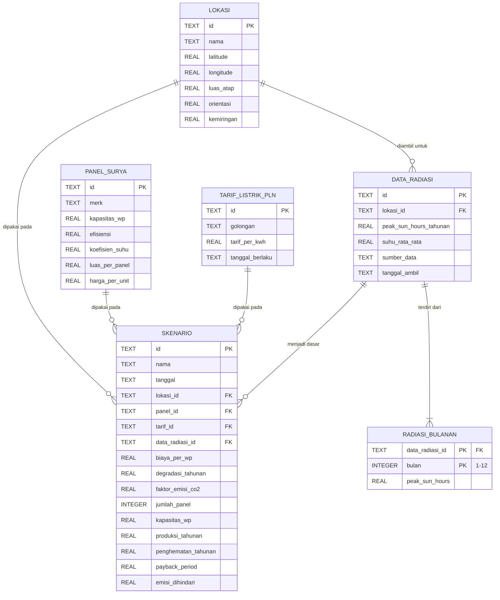

# ERD Database SunCost

Sumber: kelas di `Models/` dan `Services/`. Kondisi sekarang kode hanya punya satu tabel
(`skenario` di [RepositoriSimulasi.cs](../Services/RepositoriSimulasi.cs)) yang menyimpan hasil
perhitungan saja. ERD di bawah adalah rancangan penuh: input simulasi ikut tersimpan supaya
skenario bisa dihitung ulang dan dibandingkan.

## Diagram (Mermaid)



## Kardinalitas

| Relasi | Aturan |
|---|---|
| LOKASI → SKENARIO | satu lokasi dipakai banyak skenario (bandingkan panel/tarif berbeda di atap yang sama) |
| PANEL_SURYA → SKENARIO | satu tipe panel dipakai banyak skenario |
| TARIF_LISTRIK_PLN → SKENARIO | satu golongan tarif dipakai banyak skenario |
| LOKASI → DATA_RADIASI | tiap pengambilan API menghasilkan baris baru (riwayat, tidak ditimpa) |
| DATA_RADIASI → RADIASI_BULANAN | tepat 12 baris, satu per bulan |
| DATA_RADIASI → SKENARIO | satu set data iklim menjadi dasar banyak skenario |

`RADIASI_BULANAN` dipisah karena `DataRadiasi` menyimpan `List<double>` 12 nilai —
menaruhnya sebagai 12 kolom melanggar 1NF dan menyulitkan query per bulan.

Kolom `biaya_per_wp`, `degradasi_tahunan`, dan `faktor_emisi_co2` ikut disimpan di `SKENARIO`
karena nilainya parameter per skenario (`AnalisisFinansial`, `DampakLingkungan`), bukan entitas
tersendiri. Nilai hasil (`produksi_tahunan` … `emisi_dihindari`) disimpan sebagai snapshot supaya
riwayat tetap terbaca tanpa menghitung ulang.

## Impor ke draw.io

1. Buka draw.io → **Arrange → Insert → Advanced → Mermaid**
2. Tempel blok mermaid di atas (tanpa pagar ```), klik **Insert**

## DDL (SQLite)

```sql
CREATE TABLE lokasi (
    id          TEXT PRIMARY KEY,
    nama        TEXT NOT NULL,
    latitude    REAL NOT NULL CHECK (latitude BETWEEN -90 AND 90),
    longitude   REAL NOT NULL CHECK (longitude BETWEEN -180 AND 180),
    luas_atap   REAL NOT NULL CHECK (luas_atap > 0),
    orientasi   REAL NOT NULL CHECK (orientasi >= 0 AND orientasi < 360),
    kemiringan  REAL NOT NULL CHECK (kemiringan BETWEEN 0 AND 90)
);

CREATE TABLE panel_surya (
    id              TEXT PRIMARY KEY,
    merk            TEXT NOT NULL,
    kapasitas_wp    REAL NOT NULL CHECK (kapasitas_wp > 0),
    efisiensi       REAL NOT NULL,
    koefisien_suhu  REAL NOT NULL,
    luas_per_panel  REAL NOT NULL CHECK (luas_per_panel > 0),
    harga_per_unit  REAL NOT NULL
);

CREATE TABLE tarif_listrik_pln (
    id              TEXT PRIMARY KEY,
    golongan        TEXT NOT NULL,
    tarif_per_kwh   REAL NOT NULL CHECK (tarif_per_kwh > 0),
    tanggal_berlaku TEXT NOT NULL
);

CREATE TABLE data_radiasi (
    id                     TEXT PRIMARY KEY,
    lokasi_id              TEXT NOT NULL REFERENCES lokasi(id) ON DELETE CASCADE,
    peak_sun_hours_tahunan REAL NOT NULL,
    suhu_rata_rata         REAL NOT NULL,
    sumber_data            TEXT NOT NULL,
    tanggal_ambil          TEXT NOT NULL
);

CREATE TABLE radiasi_bulanan (
    data_radiasi_id TEXT NOT NULL REFERENCES data_radiasi(id) ON DELETE CASCADE,
    bulan           INTEGER NOT NULL CHECK (bulan BETWEEN 1 AND 12),
    peak_sun_hours  REAL NOT NULL,
    PRIMARY KEY (data_radiasi_id, bulan)
);

CREATE TABLE skenario (
    id                  TEXT PRIMARY KEY,
    nama                TEXT NOT NULL,
    tanggal             TEXT NOT NULL,
    lokasi_id           TEXT REFERENCES lokasi(id),
    panel_id            TEXT REFERENCES panel_surya(id),
    tarif_id            TEXT REFERENCES tarif_listrik_pln(id),
    data_radiasi_id     TEXT REFERENCES data_radiasi(id),
    biaya_per_wp        REAL NOT NULL,
    degradasi_tahunan   REAL NOT NULL,
    faktor_emisi_co2    REAL NOT NULL,
    jumlah_panel        INTEGER NOT NULL,
    kapasitas_wp        REAL NOT NULL,
    produksi_tahunan    REAL NOT NULL,
    penghematan_tahunan REAL NOT NULL,
    payback_period      REAL NOT NULL,
    emisi_dihindari     REAL NOT NULL
);

CREATE INDEX idx_skenario_tanggal ON skenario(tanggal DESC);
```

FK skenario dibuat nullable: skenario lama dari versi tabel sekarang (hanya kolom hasil) tetap
bisa dibaca setelah migrasi.
